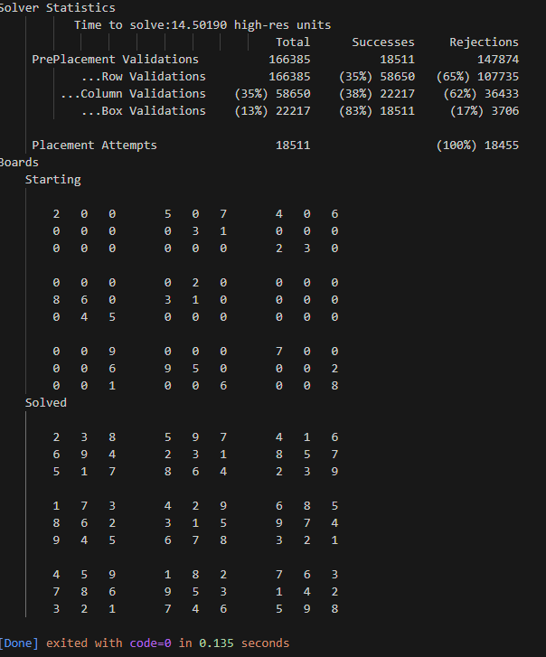

# SudokuSolver
Sudoku Puzzle Solver using a back tracking approach.  

I recently came across several articles (medium.com) describing how to create a solver for [Sudoku](https://en.wikipedia.org/wiki/Sudoku) using Python.  
  
One article took a [Linear Optimization/Programming](https://en.wikipedia.org/wiki/Linear_programming) approach. Using linear programming for a problem like Sudoku is tremendous overkill. However, Sudoku provided an excellent easy-to-grasp problem for introducing Linear Optimization concepts; something the author put to good use.   
There were articles using Neural Nets (a poorer match), search type approaches, and some pretty raw back tracking.   

Sudoku is not a "hard" problem. However, due to its potential graph complexity it can become quite difficult to work through manually.  
  
This project is a single JS file (for now anyways) which will:   
1. create a Sudoku Game (puzzle) based on an array of integers passed to it
2. solve the puzzle
3. print the unsolved and solved forms of the puzzle
4. print basic statistics generated while solving
  
It turned out to be a good bit simpler than I anticipated. The code (other than the print functions) is decent, not great but decent.

### Sample output  

  
## A few things  
The code is vanilla Javascript though assumes it's run from nodejs, `node sudoku-solver.js` as it relies on the node perf libs when gathering stats.  
  
### use of row and col   
One will see the use of: `row` and `col` in the code.   
The code does not implement a table structure, much less one composed of Rowa and Columns.  
Rather,  `row` and `col` are mere syntactic sugar. They represent X and Y coordinates respectively; coordinates of the matrix used to internally represent the puzzle.   
Put more directly, they are used to represent a `row index` or a `col [column] index`   
